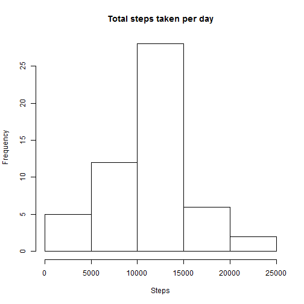

## Loading and preprocessing the data
The following code unzips and loads the data. Note that the working directory is
this repository.


```r
unzip("./activity.zip")
activity <- read.csv("./activity.csv")
```

At this point the necessary libraries for this project are loaded.


```r
library(dplyr)
library(lubridate)
library(lattice)
```

## What is mean total number of steps taken per day?
>For this part of the assignment, you can ignore the missing values in the dataset.
>
> 1. Make a histogram of the total number of steps taken each day

```r
#The total number of steps taken per day are calculated
activitysum <- activity %>%                     #Appropriate data is selected
        filter(!is.na(steps)) %>%               #NA values are filtered
        group_by(date) %>%                      #Data is grouped by date
        summarize(totalsteps = sum(steps))      #Total steps per day calculated

#A histogram of the total number of steps taken per day is generated
hist(activitysum$totalsteps, main="Total steps taken per day", xlab="Steps")
```

 

> 2. Calculate and report the **mean** and **median** total number of steps taken per day


```r
# The mean and median number of steps taken are calculated and reported
summarize(activitysum, mean(totalsteps))
```

```
## Source: local data frame [1 x 1]
## 
##   mean(totalsteps)
## 1         10766.19
```

```r
summarize(activitysum, median(totalsteps))
```

```
## Source: local data frame [1 x 1]
## 
##   median(totalsteps)
## 1              10765
```

## What is the average daily activity pattern?

>1. Make a time series plot (i.e. `type = "l"`) of the 5-minute interval (x-axis) and the average number of steps taken, averaged across all days (y-axis)


```r
#First the mean number of steps per interval is calculated
stepsbyinterval <- activity %>%              #Appropriate database is selected
        filter(!is.na(steps)) %>%               #NA values are filtered
        group_by(interval) %>%                  #Data is grouped by date
        summarize(meansteps = mean(steps))      #Total steps per interval
#The time series plot is generated
with(stepsbyinterval, plot(interval, meansteps, type='l', col="blue",
     main="Average number of steps taken across all days for each interval", 
     xlab="Interval", 
     ylab="Average number of steps taken"))
```

 


>2. Which 5-minute interval, on average across all the days in the dataset, contains the maximum number of steps?

```r
stepsbyinterval[which.max(stepsbyinterval$meansteps),1]
```

```
## Source: local data frame [1 x 1]
## 
##   interval
## 1      835
```


## Imputing missing values

> Note that there are a number of days/intervals where there are missing values (coded as `NA`). The presence of missing days may introduce bias into some calculations or summaries of the data.

> 1. Calculate and report the total number of missing values in the dataset (i.e. the total number of rows with `NA`s)

```r
nrow(filter(activity, is.na(steps)))
```

```
## [1] 2304
```
> 2. Devise a strategy for filling in all of the missing values in the dataset. The strategy does not need to be sophisticated. For example, you could use the mean/median for that day, or the mean for that 5-minute interval, etc.

The strategy I will use is to replace NA with the mean for that 5-minute interval. Note that these values were calculated and stored in the `stepsbyinterval` data frame.

> 3. Create a new dataset that is equal to the original dataset but with the missing data filled in.

```r
#First we create a vector that contains the intervals which have missing steps
missingintervals<-activity[is.na(activity$steps),3]

#We use the match function to find the index of each of these intervals
missingindex <- match(missingintervals, stepsbyinterval$interval)

#Now we extract the mean for each of the indices found
#       Note: this will create a data frame of 1 column
missingsteps <- stepsbyinterval[missingindex,2]

#Finally, the missing steps are replaced into a new variable isteps where necessary
activityi <- activity %>%                                                   #Data selected
        mutate(steps= ifelse(is.na(steps), missingsteps$meansteps, steps))  #Missing values replaced
```

> 4. Make a histogram of the total number of steps taken each day and Calculate and report the **mean** and **median** total number of steps taken per day. Do these values differ from the estimates from the first part of the assignment? What is the impact of imputing missing data on the estimates of the total daily number of steps?


```r
#The total number of steps taken per day are calculated
activityisum <- activityi %>%                   #Data is selected
        group_by(date) %>%                      #Data is grouped by date
        summarize(totalsteps = sum(steps))    #Total steps per day calculated

#A histogram of the total number of steps taken per day is generated
hist(activityisum$totalsteps, main="Total steps taken per day", xlab="Steps")
```

 

```r
# The mean and median number of steps taken are calculated and reported
summarize(activityisum, mean(totalsteps))
```

```
## Source: local data frame [1 x 1]
## 
##   mean(totalsteps)
## 1         10766.19
```

```r
summarize(activityisum, median(totalsteps))
```

```
## Source: local data frame [1 x 1]
## 
##   median(totalsteps)
## 1           10766.19
```

The mean value of steps taken does not differ. This is expected given that we introduced the mean values into each of the intervals. Also, since the imputed values contained the same number of each interval.

The median varies slightly to reflect the new values (interval means) that were imputed.

The impact of imputing missing data on the estimates of the total daily number of steps given the strategy that I used is that the mean is not affected and the median slightly is. If careful attention is given to the histogram after the data imputation, one can notice that the only part of the distribution that has changed is the central bar, reflecting the increase by the 8 days that were imputed. 

## Are there differences in activity patterns between weekdays and weekends?

> Use the dataset with the filled-in missing values for this part.
>
> 1. Create a new factor variable in the dataset with two levels -- "weekday" and "weekend" indicating whether a given date is a weekday or weekend day.

The following code creates the factor variable (mutate steps) and then groups by type of day and intervals to create a data set with the mean number of steps by day type and interval.


```r
activityidt <- activityi %>%                            # Data is selected
        mutate(daytype = wday(ymd(date))) %>%           # Days are assigned numbers from 1-7
        mutate(daytype = ifelse(daytype<6, "weekday", "weekend")) %>% #Numbers replaced with day type
        mutate(daytype = factor(daytype, levels= c("weekday", "weekend"))) %>% #Variable converted to factor
        group_by(daytype, interval) %>%                 # Data is grouped by type of day and intervals
        summarize(meansteps = mean(steps))              # Summary statistic mean is calculated for steps
```

> 2. Make a panel plot containing a time series plot (i.e. `type = "l"`) of the 5-minute interval (x-axis) and the average number of steps taken, averaged across all weekday days or weekend days (y-axis).

The following code uses the lattice package to create the specified plot.

```r
xyplot(meansteps ~ interval | daytype, activityidt, type = "l", col= "blue",
       xlab= "Interval",
       ylab= "Average number of steps taken",
       layout=c(1,2)) 
```

 
